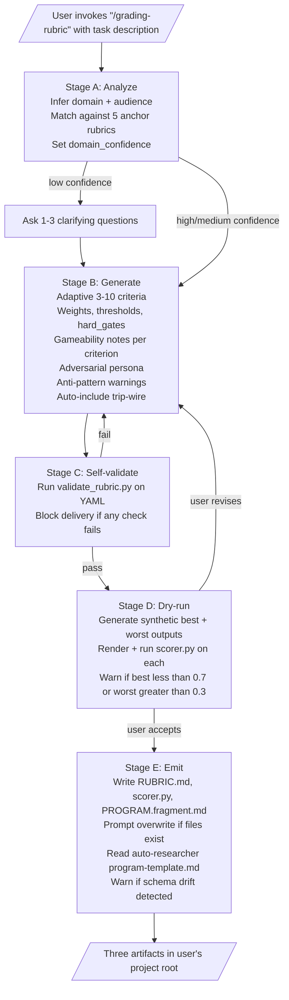
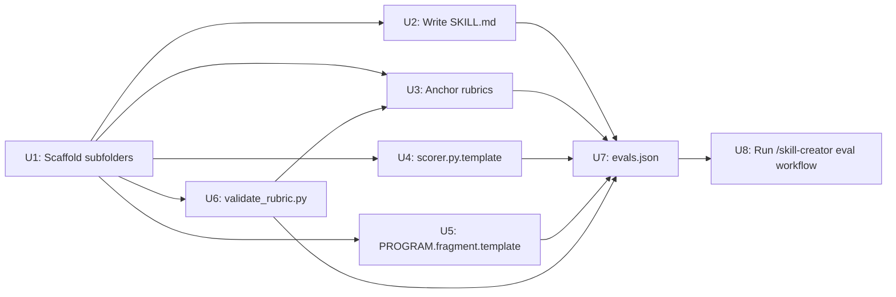

# feat: Build grading-rubric skill (rubric generator for /auto-researcher and /recursive-refine)

> **Target repo:** `C:\Users\Eddy\.claude\skills` (the personal-skills monorepo at the workspace root). All paths in this plan are repo-relative — e.g., `grading-rubric/SKILL.md` resolves to `C:\Users\Eddy\.claude\skills\grading-rubric\SKILL.md`.

## Overview

Build the `grading-rubric` skill — a meta-skill that generates the optimal scoring rubric for any iterative-validation loop, with first-class compatibility for `/auto researcher` (single-float metric) and `/recursive-refine` (per-criterion thresholds). The skill emits three artifacts to the user's project root: `RUBRIC.md` (dual-use spec), `scorer.py` (runnable composite computer with auto-included degeneracy trip-wire), and `PROGRAM.fragment.md` (paste-ready `/auto researcher` block). The full design is locked in `grading-rubric/project-spec.md` and `grading-rubric/project-constitution.md`; this plan is the build sequence for that spec.

---

## Problem Frame

The user runs unattended overnight optimization loops via `/auto researcher`, which requires exactly one numeric metric to drive its keep/revert decisions. Designing a good metric is hard: a poor rubric leads the agent to optimize toward shortcuts (Goodhart's law), silent zero scores from gate bugs hide real failures, and LLM-judge jitter breaks `min_delta`-based decisions. Today, every new loop requires hand-rolling a metric and a scorer — error-prone and not reusable. `grading-rubric` industrializes this work: generate a robust, gameability-aware, validated rubric + scorer with one invocation. The same rubric also drives `/recursive-refine`'s pass-threshold loop (single source of truth across both skills).

(see origin: `grading-rubric/project-spec.md` `<overview>`, `<assumptions>`)

---

## Requirements Trace

- **R1.** Skill triggers on explicit phrases (`/grading-rubric`, `grading rubric`, `scoring rubric`) — explicit-only, no implicit firing. *(spec: assumptions, success_criteria/functional)*
- **R2.** Generates 3–10 weighted criteria adaptively, each scored on `[0, 1]` with weight, threshold, `hard_gate` flag, and `gameability_note`. *(spec: feature "Domain-aware rubric generation")*
- **R3.** Composite always emitted in `[0, 1]`, higher-is-better, regardless of underlying task semantics. *(spec: feature "Single-float composite for /auto-researcher")*
- **R4.** Per-criterion thresholds present so the same rubric is consumable by both `/auto researcher` and `/recursive-refine` with no transformation. *(spec: feature "Per-criterion thresholds for /recursive-refine")*
- **R5.** Adversarial reviewer persona derived for every rubric (used only for LLM-judge mode, present always). *(spec: feature "Adversarial persona derivation")*
- **R6.** `regression_trip_wire` criterion auto-included (`weight: 0`, `hard_gate: true`) with four checks: empty/null output, NaN/inf/stack-trace, runtime > 10× baseline, structure invalid. User can opt out per-invocation. *(spec: feature "Trip-wire criterion (auto-included)")*
- **R7.** Hard-gate failures exit non-zero with `GATE_FAILED: <name>: <reason>` to stderr — never silent zero. *(spec: feature "Hard-gate failures surface as 'crashed' rows")*
- **R8.** LLM-judge mode auto-averages `N=3` calls per criterion, `temperature=0`, fixed seed where supported. *(spec: feature "LLM-judge averaging")*
- **R9.** Self-validation runs before delivery (`scripts/validate_rubric.py`): weights sum 1.0 ±0.001 (excluding trip-wire), thresholds in `[0, 1]`, no duplicate names, hard gates have documented fail reason, every criterion has non-empty `gameability_note`. *(spec: feature "Self-validation before delivery")*
- **R10.** Synthetic best/worst dry-run executed; warn if best < 0.7 or worst > 0.3. *(spec: feature "Synthetic dry-run sanity test")*
- **R11.** Domain-confidence banner (high|medium|low) in RUBRIC.md header; "no reference rubric matched" warning when low. *(spec: feature "Domain-confidence banner")*
- **R12.** Anti-pattern + gameability warnings inline in RUBRIC.md (Goodhart, gameable criteria, missing penalty terms, missing deterministic fallback). *(spec: feature "Anti-pattern flagging" + "Per-criterion gameability articulation")*
- **R13.** PROGRAM.fragment.md begins with `# Compatible with auto-researcher SKILL.md §3 contract as of <ISO date>`; skill reads `auto-researcher/references/program-template.md` at runtime when present and warns on schema drift. *(spec: feature "Compatibility-aware PROGRAM fragment")*
- **R14.** Safe overwrite handling: prompt user with overwrite / versioned / cancel when target files exist. *(spec: feature "Safe overwrite handling")*
- **R15.** All artifacts pass `/skill-creator` eval workflow on 3 representative test prompts. *(spec: implementation_steps step 10)*

---

## Scope Boundaries

- Generating PROGRAM.md `goal`, `editable_files`, or `run_command` — user owns these.
- Running the iterative loop itself — `/auto researcher`'s job.
- Persistent state across invocations.
- Post-hoc analysis of `EXPERIMENT_LOG.md` after a loop finishes.
- Hardcoded keyword routing per domain — universal scope, reasoning-driven.
- Domain-specific defaults beyond the 5 anchor reference rubrics.
- Implicit triggering on adjacent phrases like "design an evaluation" without an explicit rubric/scoring keyword.

### Deferred to Follow-Up Work

- **Description optimization via `claude -p`** — Skill-creator's `scripts/run_loop.py` description-optimization pass requires the Claude Code CLI which is not available in Cursor IDE. Defer to a future Claude-Code session; tune description manually for v1.
- **Packaging via `package_skill.py`** — Optional .skill bundle generation. Defer until after eval workflow stabilizes the skill.
- **>3-prompt eval expansion** — Spec calls for 3 representative test cases. If v1 ships well, expand to 6–10 across more domains in a follow-up iteration.

---

## Context & Research

### Relevant Code and Patterns

- `auto-researcher/SKILL.md` §3–§7 — PROGRAM.md schema, metric_source contract, EXPERIMENT_LOG.md row format. Our PROGRAM.fragment must conform exactly.
- `auto-researcher/references/program-template.md` — runtime-readable template the skill checks for schema drift (R13).
- `recursive-refine/SKILL.md` Step 1 (Stages A–C) + Appendix — rubric structure conventions and adversarial persona pattern. Our RUBRIC.md must be consumable by this workflow.
- `recursive-refine/evals/evals.json` — concrete `evals.json` schema with `expectations` (natural-language assertions list), `expected_output` (string), `baseline_constraints` (constraints applied to no-skill baseline). Our `grading-rubric/evals/evals.json` will follow this exact shape.
- `skill-creator/SKILL.md` "Anatomy of a Skill" — `references/`, `scripts/`, `assets/` conventions; SKILL.md ≤500 lines guideline; progressive disclosure pattern.
- `skill-creator/SKILL.md` "Description Optimization" — explains how YAML description drives triggering; informs how we phrase R1's description string.

### Institutional Learnings

- `karpathy-coding-discipline.mdc` (always-on workspace rule) — surgical edits, simplicity first, explain *why* in instructions over heavy-handed MUSTs. Apply to SKILL.md prose style.
- `global_cursor_rules.mdc` — UTF-8 encoding everywhere, `uv run python` for Python entry points, no bare `python`.
- No `docs/solutions/` folder exists in this skills repo — institutional learning store does not apply.

### External References

- None gathered — local patterns and the spec are sufficient (see Phase 1.2 decision in `/ce-plan`).

---

## Key Technical Decisions

- **RUBRIC.md uses YAML frontmatter as single source of truth.** All rubric metadata + criteria array live in the YAML block at the top of the file. The markdown body below renders a human-readable summary table (criteria name, weight, threshold, hard_gate) plus persona, anti-patterns, and scorer-implementation-notes sections. The summary table is regenerated from the YAML — never hand-edited. *Rationale:* one place to parse, one place to mutate; eliminates table-vs-YAML drift.
- **scorer.py embeds criteria as Python literals at emit time** rather than parsing RUBRIC.md at runtime. The skill renders both files together; regenerating one without the other is forbidden (skill enforces). *Rationale:* honors constitution's "stdlib only in scorer.py.template" — avoids forcing PyYAML on user projects. The skill itself can use PyYAML (via `uv`) for validation.
- **Template substitution uses `string.Template` with `${...}` placeholders.** *Rationale:* stdlib, avoids collision with Python's `{...}` brace usage in the template body, safer than f-strings or `str.format()` for complex code templates.
- **`validate_rubric.py` uses `PyYAML` (declared in `pyproject.toml` for `uv`).** Validator is not stdlib-constrained — only the user-facing `scorer.py.template` is. *Rationale:* spec constitution explicitly limits stdlib-only to the scorer template.
- **Skill writes to user's CWD by default**, with optional `--output-dir <path>` override during invocation. *Rationale:* users typically invoke from their project root where PROGRAM.md will live.
- **`assets/` folder for templates** (new pattern — no existing skill uses this folder name). *Rationale:* `references/` is for context the agent reads; `scripts/` is for executables the agent runs; `assets/` is for files the agent emits to user's project. Clear separation of intent.
- **Two scorer modes selected at emit time, not runtime: `deterministic` vs `llm_judge`.** Skill picks mode based on whether any criterion's `what_9_of_10_looks_like` requires subjective judgment. The emitted `scorer.py` contains only the chosen mode's code (not a runtime branch). *Rationale:* keeps each emitted scorer minimal and stdlib-only; runtime LLM API call only present when needed.
- **Plan file colocated with spec/constitution** (`grading-rubric/plan.md`), not under `docs/plans/`. *Rationale:* one-plan-per-skill scope; the date-numbered registry pattern is overkill here.

---

## Open Questions

### Resolved During Planning

- **Where do criteria live (YAML vs markdown table)?** YAML frontmatter is source of truth; markdown summary regenerated from it.
- **Does scorer parse RUBRIC.md at runtime?** No — criteria embedded as Python literals at emit time.
- **Templating mechanism?** `string.Template` with `${...}` placeholders.
- **Plan file location?** Colocated with spec/constitution at `grading-rubric/plan.md`.
- **`assets/` folder convention?** Adopted as new pattern, scoped to skill-emitted templates.

### Deferred to Implementation

- **Exact synthetic best-case / worst-case generators per anchor domain.** Plan specifies *that* we generate them; the precise content (e.g., "for trading: best = perfect Sharpe + low DD JSON; worst = empty CSV") is a per-anchor implementation detail discovered while writing the anchor reference rubrics (U3) and scorer template (U4).
- **LLM-judge prompt template structure.** Plan specifies N=3 averaging + temperature=0; the precise judge-prompt format will emerge during scorer template implementation (U4) — likely a system-message + criterion-block pattern, but final shape depends on what produces stable scores.
- **Trip-wire baseline runtime measurement source.** Trip-wire's "runtime > 10× baseline" check needs a baseline runtime number. Decide at U4: probably read from a `.baseline_runtime` file the user writes once after first successful run, or skip the runtime check when no baseline file exists.

---

## High-Level Technical Design

> *This illustrates the intended workflow shape and is directional guidance for review, not implementation specification. The implementing agent should treat it as context, not code to reproduce.*

### Skill workflow (Stage A→E) — runtime behavior of the SKILL.md instructions



### Implementation unit dependency graph



*Note: U6 → U3 edge — anchor rubrics (U3) must pass `validate_rubric.py` (U6) as part of their definition-of-done, so U6 is a soft prerequisite for U3's verification step. U3 can be drafted in parallel with U6, but verification waits.*

---

## Output Structure

```
grading-rubric/
├── SKILL.md                                  # U2: skill workflow + YAML frontmatter
├── project-spec.md                           # (already written via /project-spec)
├── project-constitution.md                   # (already written via /project-spec)
├── plan.md                                   # (this file)
├── pyproject.toml                            # U6: uv config for validate_rubric.py
├── references/                               # U3: anchor rubrics
│   ├── trading-strategy.md
│   ├── code-quality.md
│   ├── writing.md
│   ├── ml-eval.md
│   └── generic-task.md
├── assets/                                   # U4, U5: emit-time templates
│   ├── scorer.py.template
│   └── PROGRAM.fragment.md.template
├── scripts/                                  # U6: skill-internal tooling
│   └── validate_rubric.py
└── evals/                                    # U7: skill-creator test cases
    └── evals.json
```

*This is a scope declaration showing the expected output shape. The implementer may adjust if implementation reveals a better layout — the per-unit `**Files:**` sections remain authoritative.*

---

## Implementation Units

- [ ] **U1. Scaffold skill subfolders**

**Goal:** Create the `references/`, `assets/`, `scripts/`, `evals/` subfolders inside `grading-rubric/`. The folder itself + `project-spec.md` + `project-constitution.md` + `plan.md` already exist.

**Requirements:** structural prerequisite for R1–R15.

**Dependencies:** none.

**Files:**
- Create: `grading-rubric/references/` (empty)
- Create: `grading-rubric/assets/` (empty)
- Create: `grading-rubric/scripts/` (empty)
- Create: `grading-rubric/evals/` (empty)

**Approach:**
- Single PowerShell `New-Item -ItemType Directory` invocation per folder, idempotent (`-Force`).
- No content yet — just directory shells.

**Test scenarios:**
- *Test expectation: none — pure folder scaffolding with no behavioral surface.*

**Verification:**
- `Get-ChildItem grading-rubric/ -Directory` lists all four subfolders.

---

- [ ] **U2. Write `SKILL.md` v1 (frontmatter + complete Stage A→E workflow)**

**Goal:** Author the canonical skill file: trigger-tuned YAML frontmatter + workflow body covering Stages A (analyze), B (generate, including gameability + adversarial persona + anti-pattern + domain-confidence logic inline), C (self-validate), D (dry-run sanity), E (emit). Body ≤500 lines; deeper detail goes into `references/`.

**Requirements:** R1, R2, R5, R10, R11, R12.

**Dependencies:** U1 (folder must exist).

**Files:**
- Create: `grading-rubric/SKILL.md`

**Approach:**
- YAML frontmatter mirrors `auto-researcher/SKILL.md` style — `name: grading-rubric`, `description: >-` block scalar with explicit triggers (`/grading-rubric`, `grading rubric`, `scoring rubric`) AND scope-narrowing language (e.g., "for iterative-validation loops", "for /auto researcher or /recursive-refine") to prevent accidental firing on student-grading or evaluation contexts (R12 anti-pattern self-defense).
- Body sections (in order): purpose; trigger criteria; Stage A (analyze, with confidence-classification rules); Stage B (generate, including the 3-stage reasoning protocol from `recursive-refine` Step 1 adapted for rubric generation, plus per-criterion gameability articulation rule, adversarial persona derivation, anti-pattern checklist, domain-confidence banner spec); Stage C (run `validate_rubric.py`, abort on failure); Stage D (synthesize best/worst, render+run scorer, warn-and-offer-revise on `best<0.7` or `worst>0.3`); Stage E (emit three artifacts, overwrite handling, runtime read of `auto-researcher/references/program-template.md` for schema drift detection); references to `references/*.md` anchor rubrics and `assets/*.template` files.
- Cite `karpathy-coding-discipline` voice — explain *why* over heavy MUSTs.

**Execution note:** Draft frontmatter description first, then iterate after seeing test trigger results in U8. Description quality drives R1 and is hardest to get right in one pass.

**Patterns to follow:**
- `auto-researcher/SKILL.md` overall structure (numbered sections, hard rules block, error-handling table).
- `recursive-refine/SKILL.md` Stage A/B/C labeling pattern.
- `skill-creator/SKILL.md` "Description Optimization" guidance for description string crafting.

**Test scenarios:**
- *Happy path:* SKILL.md parses as valid markdown with valid YAML frontmatter (`python -c "import yaml; yaml.safe_load(open('grading-rubric/SKILL.md').read().split('---')[1])"` succeeds).
- *Format compliance:* frontmatter contains `name` and `description` keys; description mentions all three trigger phrases verbatim.
- *Length budget:* SKILL.md body ≤500 lines (`(Get-Content grading-rubric/SKILL.md).Count` ≤500).
- *Cross-reference integrity:* every `references/*.md` and `assets/*.template` filename mentioned in SKILL.md exists after U3/U4/U5 land.
- *Trigger reliability* (deferred to U8): the 3 `evals/evals.json` test prompts each invoke the skill (covered by /skill-creator eval).

**Verification:**
- File exists, passes the four checks above, and a manual read pass confirms all five stages (A–E) are present with concrete instructions.

---

- [ ] **U3. Build 5 anchor reference rubrics**

**Goal:** Author 5 worked-example rubrics in `references/` covering distinct domains. Each is a complete, validated example showing all data-shape fields populated correctly. These are *anchors* the skill consults during Stage A — never copy-paste defaults.

**Requirements:** R2, R5, R6, R11, R12.

**Dependencies:** U1; soft dependency on U6 (anchors must pass `validate_rubric.py` as definition-of-done).

**Files:**
- Create: `grading-rubric/references/trading-strategy.md` (e.g., momentum SPY loop with Sharpe + drawdown + turnover criteria)
- Create: `grading-rubric/references/code-quality.md` (e.g., Python module readability with mixed deterministic + LLM-judge criteria)
- Create: `grading-rubric/references/writing.md` (e.g., 1-page macro research summary with clarity + specificity + structure criteria)
- Create: `grading-rubric/references/ml-eval.md` (e.g., classification model with accuracy + calibration + fairness + inference latency criteria)
- Create: `grading-rubric/references/generic-task.md` (deliberately domain-agnostic fallback, used when domain confidence is low)

**Approach:**
- Each anchor: YAML frontmatter (rubric_name, domain_confidence: high, composite_formula, composite_direction: higher, trip_wire_enabled: true, iso_generated_at) + criteria array (3–6 criteria for these examples) + adversarial persona section + anti-pattern warnings section + scorer implementation notes section.
- Every criterion has non-empty `gameability_note` — this is the most-skipped field and we set the standard here.
- At least one anchor (likely `code-quality.md`) demonstrates a `hard_gate: true` non-trip-wire criterion (e.g., "tests must pass") so the skill has a worked example to mirror.
- The `generic-task.md` anchor lists 3–4 broadly applicable criteria (correctness, completeness, clarity, efficiency) with explicit caveats about domain-confidence: low usage.

**Patterns to follow:**
- `recursive-refine/SKILL.md` Appendix examples for criterion table structure.
- Spec's `<rubric_data_shape>` section for exact field names and types.

**Test scenarios:**
- *Happy path (each anchor):* `uv run python grading-rubric/scripts/validate_rubric.py grading-rubric/references/<anchor>.md` exits 0.
- *Field completeness:* each anchor has rubric_name, domain_confidence=high, composite_formula, composite_direction=higher, trip_wire_enabled=true, iso_generated_at, ≥3 criteria, persona section, anti-patterns section, scorer notes section.
- *Gameability coverage:* every criterion across all 5 anchors has a non-empty `gameability_note`.
- *Trip-wire presence:* every anchor's YAML includes the `regression_trip_wire` criterion entry with `weight: 0`, `hard_gate: true`.
- *Diversity check:* the 5 anchors use distinct domain terminology — no copy-paste of criterion names across files (manual review).

**Verification:**
- All 5 files exist; all pass U6's validator; manual review confirms domain diversity and gameability_note quality.

---

- [ ] **U4. Build `assets/scorer.py.template`**

**Goal:** Parameterized Python template (stdlib only) that the skill renders at emit time. Computes weighted arithmetic mean × hard-gate multiplier, supports `deterministic` vs `llm_judge` modes (mode chosen at emit time), includes all four `regression_trip_wire` checks, prints `composite: <float>`, exits non-zero with `GATE_FAILED: <name>: <reason>` to stderr on hard-gate failure.

**Requirements:** R3, R6, R7, R8.

**Dependencies:** U1.

**Files:**
- Create: `grading-rubric/assets/scorer.py.template`

**Approach:**
- Use `string.Template` with `${criteria_python_literal}`, `${mode}` (literal `deterministic` or `llm_judge`), `${trip_wire_enabled}`, `${baseline_runtime_seconds_or_none}` placeholders.
- Two mode branches in the template — emit-time renderer keeps only the chosen branch (skill responsibility, not runtime).
- Trip-wire checks: (1) output empty/null → fail; (2) output contains `NaN`, `inf`, `Traceback`, or `Error:` substrings → fail; (3) wall-clock > `10 × ${baseline_runtime_seconds}` (skip if baseline is None) → fail; (4) output structure invalid (parses as JSON if expected_format=json, etc.) → fail. Each check has a distinct gate_name string.
- LLM-judge mode: `_score_criterion_llm(criterion)` calls API 3 times (`temperature=0`, fixed seed where supported), returns mean. Use `urllib.request` (stdlib) to call the API endpoint configured via env var `RUBRIC_LLM_ENDPOINT` and key from `RUBRIC_LLM_API_KEY`; fail loudly if env vars missing.
- Output contract: success path prints exactly one line to stdout: `composite: 0.834` (float ∈ `[0, 1]`); on hard-gate failure, exits with code 1 and stderr line `GATE_FAILED: regression_trip_wire.empty_output: output file is 0 bytes`.

**Patterns to follow:**
- `auto-researcher/SKILL.md` §4 metric extraction contract — our scorer's output must match `stdout_pattern: "composite:\\s*([\\d.]+)"`.
- Constitution: stdlib only — no `requests`, no `pyyaml` in this template.

**Test scenarios:**
- *Happy path (deterministic mode):* render template with a 3-criterion config (weights 0.5/0.3/0.2) where all criteria pre-scored to 1.0 → run → stdout matches `composite: 1.0`, exit 0.
- *Happy path (deterministic mode, mid-score):* same template, criteria scored 0.8/0.6/0.4 → composite ≈ 0.66, exit 0.
- *Hard-gate path:* render with `regression_trip_wire` enabled, run on empty output file → exit 1, stderr contains `GATE_FAILED: regression_trip_wire.empty_output:`.
- *Hard-gate path (NaN):* feed output containing `NaN` → exit 1, stderr contains `GATE_FAILED: regression_trip_wire.nan_or_error:`.
- *Hard-gate path (runtime):* render with `${baseline_runtime_seconds_or_none}` set to 1.0, simulate 15s run → exit 1, stderr contains `GATE_FAILED: regression_trip_wire.runtime_exceeded:`.
- *Edge case (trip-wire disabled):* render with `${trip_wire_enabled}` = False, empty output → exit 0, composite reflects criterion scores only.
- *Integration:* rendered scorer's stdout matches auto-researcher's default regex `composite:\s*([\d.]+)` — verify by running auto-researcher's pattern against scorer output.
- *LLM-judge mode mock:* render in llm_judge mode with mocked endpoint returning fixed scores → averages 3 calls, composite matches expected mean within 0.001.

**Verification:**
- All 7 test scenarios pass; rendered scorers compile cleanly via `python -m py_compile`; output regex compatible with auto-researcher.

---

- [ ] **U5. Build `assets/PROGRAM.fragment.md.template`**

**Goal:** Paste-ready PROGRAM.md fragment template emitted to user's project root. Begins with auto-researcher compatibility comment, includes `metric_*` block targeting the generated scorer, with calibration guidance for `min_delta`.

**Requirements:** R3, R8 (min_delta guidance), R13.

**Dependencies:** U1; conceptually depends on U4 (must reference scorer.py).

**Files:**
- Create: `grading-rubric/assets/PROGRAM.fragment.md.template`

**Approach:**
- Header line: `# Compatible with auto-researcher SKILL.md §3 contract as of ${iso_date}`
- YAML block placeholders:
  - `metric_name: ${rubric_name}_composite`
  - `metric_direction: higher`
  - `metric_source: eval_command`
  - `eval_command: "python scorer.py"`
  - `min_delta: ${min_delta_recommendation}` — for deterministic mode, recommend `0.001`; for llm_judge mode, render an inline comment: `# CALIBRATE: run scorer 5x on baseline output; set min_delta >= 2 * stddev`
- Trailing markdown commentary: brief paragraph on what `composite` means and how to disable trip-wire.

**Patterns to follow:**
- `auto-researcher/references/program-template.md` exact key names and formatting (validates R13's "schema drift" check has something to compare against).

**Test scenarios:**
- *Happy path:* render with sample params → result is valid YAML inside the markdown block; all 5 keys present; header comment present with ISO date.
- *Schema parity:* every required key listed in `auto-researcher/references/program-template.md` "Field reference" table is either present in our fragment or explicitly noted as user-owned in the trailing markdown commentary (`goal`, `editable_files`, `run_command`).
- *Mode-specific min_delta:* deterministic mode renders `min_delta: 0.001`; llm_judge mode renders the calibration comment.
- *Integration:* concatenating our fragment with a minimal user `goal`/`editable_files`/`run_command` block produces a PROGRAM.md that auto-researcher's `validate_program.py` would accept (manual check by reading auto-researcher's validator logic — full integration test deferred).

**Verification:**
- All 4 test scenarios pass; one rendered example included in the skill's eval workflow (U7 prompt 1 will check this).

---

- [ ] **U6. Build `scripts/validate_rubric.py` + `pyproject.toml`**

**Goal:** Standalone CLI validator: parses RUBRIC.md's YAML frontmatter, runs all structural checks, exits 0 on valid, non-zero with clear stderr messages on failures. Used by Stage C of the skill workflow.

**Requirements:** R9.

**Dependencies:** U1.

**Files:**
- Create: `grading-rubric/scripts/validate_rubric.py`
- Create: `grading-rubric/pyproject.toml` (declares `pyyaml` dependency for `uv` runs)

**Approach:**
- Parse `<RUBRIC.md>` frontmatter (between first two `---` lines) using PyYAML.
- Checks (each emits one stderr line on failure, accumulates errors before exiting):
  1. Required top-level fields: rubric_name, domain_confidence ∈ {high, medium, low}, composite_formula, composite_direction == "higher", trip_wire_enabled (bool), iso_generated_at (ISO 8601 parseable).
  2. `criteria` is a non-empty list of dicts.
  3. Every criterion has: `name` (unique across criteria), `definition` (non-empty), `what_9_of_10_looks_like` (non-empty), `weight` (float in `[0, 1]`), `threshold` (float in `[0, 1]`), `hard_gate` (bool, default false), `gameability_note` (non-empty string).
  4. **Weights sum to 1.0 ±0.001 across criteria where `hard_gate == false` and `name != "regression_trip_wire"`** (hard-gate criteria contribute 0/1 multiplicatively, not weighted).
  5. No duplicate criterion names.
  6. Every criterion with `hard_gate == true` has a `fail_reason` (non-empty string field) documenting what failure means.
  7. If `trip_wire_enabled == true`, the `regression_trip_wire` criterion is present with `weight: 0`, `hard_gate: true`, and a `checks` list with at least one of: empty_output, nan_or_error, runtime_exceeded, structure_invalid.
- Exit code: 0 if all pass, 1 if any check fails. Stderr lists every failure (not just the first) so user can fix in one pass.
- CLI: `uv run python scripts/validate_rubric.py <path-to-RUBRIC.md>` (no flags needed for v1).

**Patterns to follow:**
- `auto-researcher/scripts/validate_program.py` if present — match its CLI signature and error reporting style.

**Test scenarios:**
- *Happy path:* validate each of the 5 anchor rubrics from U3 → exit 0, no stderr.
- *Error path (weight sum):* feed a rubric where weights sum to 0.95 → exit 1, stderr contains "weights sum to 0.950, expected 1.0".
- *Error path (missing threshold):* feed a rubric where one criterion lacks `threshold` → exit 1, stderr names the offending criterion.
- *Error path (duplicate names):* feed a rubric with two criteria both named "correctness" → exit 1, stderr names the duplicate.
- *Error path (hard_gate without fail_reason):* feed a rubric with `hard_gate: true` criterion lacking `fail_reason` → exit 1, stderr names the criterion.
- *Error path (missing gameability_note):* feed a rubric with one criterion lacking `gameability_note` → exit 1, stderr names the criterion.
- *Error path (trip-wire missing when enabled):* `trip_wire_enabled: true` but no `regression_trip_wire` criterion → exit 1.
- *Error path (multiple errors):* feed a rubric with weight-sum + duplicate-name + missing-threshold → exit 1, stderr lists all three (no early exit on first failure).
- *Edge case (trip-wire disabled):* `trip_wire_enabled: false` and no `regression_trip_wire` criterion → exit 0 (no error).

**Verification:**
- All 9 test scenarios pass; runs cleanly via `uv run python` from any working directory.

---

- [ ] **U7. Write `evals/evals.json` (3 representative test prompts + assertions)**

**Goal:** Author the 3 test cases that drive the `/skill-creator` eval workflow in U8. Each prompt is realistic (concrete, not abstract), covers a distinct domain, and includes both `expectations` (with-skill assertions) and `baseline_constraints` (constraints applied to no-skill baseline so contrast is meaningful).

**Requirements:** R15.

**Dependencies:** U1, U2 (need SKILL.md to know what behavior we're asserting); soft dependency on U3, U4, U5, U6 (assertions reference artifacts these units produce).

**Files:**
- Create: `grading-rubric/evals/evals.json`

**Approach:**
- Match `recursive-refine/evals/evals.json` schema exactly: `skill_name`, `evals: [{id, prompt, expectations, expected_output, baseline_constraints, files}]`.
- Three prompts (concrete, in user's voice — not abstract task descriptions):
  1. **Trading loop:** "I'm building an /auto researcher loop to optimize a momentum strategy on SPY using vectorbt. The signal is a crossover of two SMAs whose windows I want to evolve. My eval prints the Sharpe, max drawdown, and turnover after a backtest. Help me design the rubric so the agent doesn't just chase Sharpe and ignore drawdown."
  2. **Code refactor loop:** "I want to use /auto researcher to refactor `src/parser.py` for readability. Each iteration runs `pytest tests/test_parser.py` and outputs a diff. I need a rubric that values readability, doesn't break tests, and doesn't let the agent just delete code."
  3. **Research summary refinement:** "Design a rubric for /recursive-refine on a 1-page macro research summary about Fed policy expectations. The audience is a buy-side PM. I want it to be specific, sourced, and not hedgy."
- Per-prompt `expectations` (4–5 each, natural-language assertions checked by skill-creator's grader):
  - Prompt 1: RUBRIC.md exists with ≥4 criteria; one criterion explicitly addresses drawdown control (not just Sharpe); regression_trip_wire present; scorer.py exits non-zero on synthetic NaN-returns input; PROGRAM.fragment.md includes auto-researcher compatibility comment.
  - Prompt 2: RUBRIC.md exists with a `hard_gate: true` "tests pass" criterion; one criterion addresses the "deletion" gameability shortcut (e.g., "code coverage maintained" or similar counter-criterion); scorer.py runs without errors on synthetic input; gameability_note for every criterion is non-empty.
  - Prompt 3: RUBRIC.md exists with criteria covering specificity AND sourcing AND non-hedging; adversarial persona section present and references buy-side PM context; PROGRAM.fragment.md present with min_delta calibration guidance for llm_judge mode.
- Per-prompt `baseline_constraints` (constrains no-skill baseline run to ensure meaningful contrast):
  - Prompt 1: "BASELINE ONLY — produce a single-paragraph rubric description; do NOT create separate RUBRIC.md / scorer.py / PROGRAM.fragment.md files; do NOT include gameability notes."
  - Prompt 2: similar constraints.
  - Prompt 3: similar constraints.

**Patterns to follow:**
- `recursive-refine/evals/evals.json` for exact JSON schema (id, prompt, expectations, expected_output, baseline_constraints, files).
- Skill-creator's "Test Cases" section: "realistic ... the kind of thing a real user would actually say."

**Test scenarios:**
- *Happy path:* `python -c "import json; json.load(open('grading-rubric/evals/evals.json'))"` parses cleanly.
- *Schema compliance:* every eval has id (int), prompt (non-empty str), expectations (list of ≥3 strs), expected_output (non-empty str), baseline_constraints (non-empty str), files (list).
- *Realism check:* manual review confirms each prompt sounds like a real user, not "design a rubric for X" abstract framing.
- *Coverage:* across the 3 prompts, the assertions collectively exercise R3, R5, R6, R7, R12, R13.

**Verification:**
- All 4 test scenarios pass; manual review against `recursive-refine/evals/evals.json` for tone/quality parity.

---

- [ ] **U8. Run `/skill-creator` eval workflow and iterate**

**Goal:** End-to-end validation. Spawn 3 with-skill subagents (each runs the skill on one eval prompt) + 3 baseline subagents (each runs the prompt without the skill, under `baseline_constraints`) in parallel. Capture timing/tokens. Grade via assertions. Aggregate into benchmark. Launch `eval-viewer/generate_review.py`. User reviews qualitatively + quantitatively. Iterate based on feedback.

**Requirements:** R15 + holistic validation of R1–R14.

**Dependencies:** U1–U7 all complete.

**Files:**
- Create: `grading-rubric-workspace/iteration-1/eval-{0,1,2}/{with_skill,without_skill}/outputs/` (workspace structure per skill-creator conventions)
- Create: `grading-rubric-workspace/iteration-1/eval-{0,1,2}/eval_metadata.json`
- Create: `grading-rubric-workspace/iteration-1/eval-{0,1,2}/{with_skill,without_skill}/grading.json`
- Create: `grading-rubric-workspace/iteration-1/eval-{0,1,2}/{with_skill,without_skill}/timing.json`
- Create: `grading-rubric-workspace/iteration-1/benchmark.json` (aggregated)
- Create: `grading-rubric-workspace/iteration-1/feedback.json` (user feedback from viewer)

**Approach:**
- Follow `skill-creator/SKILL.md` "Running and evaluating test cases" sequence:
  1. Spawn all 6 subagents in one message (parallel) — Task tool with `subagent_type: generalPurpose`. Each subagent prompt mirrors the skill-creator template (skill path, task, input files=none, save outputs to <workspace>/iteration-1/eval-N/{with_skill|without_skill}/outputs/).
  2. While running, draft assertions (already done in U7 — copy into eval_metadata.json files).
  3. As notifications arrive, capture `total_tokens` + `duration_ms` into per-run `timing.json`.
  4. Once all 6 done, grade each run by reading outputs and checking each assertion (use a grader subagent per skill-creator's `agents/grader.md`). Save `grading.json`.
  5. Aggregate into `benchmark.json` via `uv run python -m scripts.aggregate_benchmark <workspace>/iteration-1 --skill-name grading-rubric` from `C:\Users\Eddy\.claude\skills\skill-creator\`.
  6. Launch viewer in background: `uv run python eval-viewer/generate_review.py "<workspace>/iteration-1" --skill-name "grading-rubric" --benchmark "<workspace>/iteration-1/benchmark.json"` with `block_until_ms: 0`. (If headless, use `--static <output_path>` and open the HTML.)
  7. User reviews via browser; submits feedback → `feedback.json`.
  8. Read feedback; if any failures or substantive complaints, plan iteration-2 improvements to SKILL.md / templates / anchors; rerun. Stop when user is satisfied OR all assertions pass with empty feedback.
- Limit to **2 iterations max** for v1 — stop sooner if user is satisfied. Description optimization (`scripts.run_loop`) is deferred (requires `claude -p`, not available in Cursor IDE).

**Execution note:** This unit is the only one where actual execution time is significant (subagent runs may take minutes each). Spawn all 6 in parallel from one message. Do not poll; react to completion notifications.

**Patterns to follow:**
- `skill-creator/SKILL.md` "Step 1: Spawn all runs (with-skill AND baseline) in the same turn" — critical to spawn together, not sequentially.
- `skill-creator/SKILL.md` "Step 4: Grade, aggregate, and launch the viewer" — exact field names in `grading.json` (`text`, `passed`, `evidence`).

**Test scenarios:**
- *Happy path:* All 6 subagents complete; benchmark.json shows with_skill > baseline on at least 2 of 3 prompts on assertion pass-rate.
- *Quality bar:* with_skill pass-rate ≥80% across all assertions on iteration-1 OR iteration-2.
- *Smoke check:* viewer opens in browser (or static HTML opens); user can navigate Outputs and Benchmark tabs.
- *Feedback loop:* feedback.json successfully reads back into the conversation after user submits.
- *Termination:* loop exits cleanly within 2 iterations.

**Verification:**
- User signs off on the skill quality via the viewer feedback flow OR explicit chat confirmation.

---

## System-Wide Impact

- **Interaction graph:** New skill in `C:\Users\Eddy\.claude\skills\grading-rubric\`. Skill-emitted artifacts (`RUBRIC.md`, `scorer.py`, `PROGRAM.fragment.md`) are consumed by `/auto researcher` (PROGRAM fragment + scorer for metric extraction) and `/recursive-refine` (RUBRIC.md for thresholds + persona). No code changes to existing skills.
- **Error propagation:** Hard-gate failures in scorer.py exit non-zero with stderr → auto-researcher's §3 step 7 treats as "exit code ≠ 0 → crash path → revert", which is the desired behavior. The `GATE_FAILED:` stderr line surfaces in EXPERIMENT_LOG.md crash diagnostics for post-mortem.
- **State lifecycle risks:** Overwrite handling (R14) prevents accidental loss of prior rubric work. No persistent state across skill invocations (each call regenerates RUBRIC.md + scorer.py + PROGRAM.fragment.md atomically).
- **API surface parity:** PROGRAM.fragment.md must remain compatible with auto-researcher's PROGRAM.md schema. Schema-drift detection (R13, runtime read of `auto-researcher/references/program-template.md`) catches drift but does not auto-fix — user is warned and must update the skill if auto-researcher evolves.
- **Integration coverage:** U8's eval workflow is the integration test. Beyond that, manual end-to-end smoke test (paste a generated PROGRAM.fragment + scorer into a real auto-researcher loop) is recommended before declaring v1 ready for daily use — flag in handoff.
- **Unchanged invariants:** `/auto researcher`'s SKILL.md, PROGRAM.md schema, EXPERIMENT_LOG.md format, and `/recursive-refine`'s SKILL.md remain untouched. This skill consumes their contracts; it does not change them.

---

## Risks & Dependencies

| Risk | Mitigation |
|------|------------|
| **Anchor rubric quality drift** — sloppy anchors → generated rubrics inherit sloppiness. | Each anchor passes `validate_rubric.py` as definition-of-done (U3); manual review for domain diversity and `gameability_note` quality. |
| **Trigger description ambiguity** — "scoring rubric" might fire on student-grading or unrelated evaluation contexts. | SKILL.md description (U2) explicitly scopes to "iterative-validation loops" and names `/auto researcher` / `/recursive-refine` as primary consumers. Trigger reliability validated by U8 evals. |
| **scorer.py.template bloat from supporting both deterministic and llm_judge modes.** | Mode chosen at emit time (Key Technical Decision) — emitted scorer contains only the chosen branch, not a runtime if-else. |
| **PROGRAM.fragment compatibility check fails when `auto-researcher/references/program-template.md` is missing.** | Skill warns but does not crash — emits fragment with current best-known schema and a stderr note. |
| **/skill-creator eval workflow takes hours and user loses interest.** | Cap at 2 iterations for v1 (U8 execution note). Spawn all 6 subagents in parallel. Skip description optimization (Cursor IDE constraint, deferred). |
| **PyYAML availability for validator** — the user's `uv` environment may not have PyYAML pre-installed. | `grading-rubric/pyproject.toml` declares `pyyaml` as a dependency (U6); `uv run python scripts/validate_rubric.py ...` resolves it on first run. |
| **`assets/` folder is a new convention** — future me (or other agents) may not understand its role. | Brief explanatory section in SKILL.md naming `assets/` as the emit-time-template folder, distinct from `references/` (agent-readable context) and `scripts/` (skill-internal executables). |

---

## Documentation / Operational Notes

- **Skill self-documentation:** SKILL.md (U2) is the canonical user-facing doc; `project-spec.md` and `project-constitution.md` remain in the skill folder as design reference.
- **No external docs to update** — this is a personal skill, not a published library. No README expansion, no CHANGELOG updates outside the skill folder.
- **Manual end-to-end smoke test recommended after U8** before declaring v1 production-ready: invoke `/grading-rubric` against a real upcoming `/auto researcher` task and run one full keep/revert iteration, confirming the scorer integrates cleanly with auto-researcher's metric extraction.

---

## Sources & References

- **Origin documents:**
  - `grading-rubric/project-spec.md` (XML spec, 18 KB, all `<core_features>` traced to R-IDs above)
  - `grading-rubric/project-constitution.md` (hard boundaries — informs Key Technical Decisions on stdlib-only scorer)
- **Integration contracts:**
  - `auto-researcher/SKILL.md` §3 (experiment loop), §4 (metric extraction), §7 (EXPERIMENT_LOG.md format)
  - `auto-researcher/references/program-template.md` (PROGRAM.md schema, runtime-read by R13)
  - `recursive-refine/SKILL.md` Stages A–C and Appendix (rubric structure conventions)
- **Build vehicle:**
  - `skill-creator/SKILL.md` "Anatomy of a Skill", "Running and evaluating test cases", "Description Optimization"
  - `recursive-refine/evals/evals.json` (concrete schema reference for U7)
- **Workspace rules consulted:**
  - `c:\Users\Eddy\.cursor\rules\karpathy-coding-discipline.mdc` (informs SKILL.md prose style)
  - `c:\Users\Eddy\.cursor\rules\global_cursor_rules.mdc` (uv usage, UTF-8 encoding, no bare `python`)
